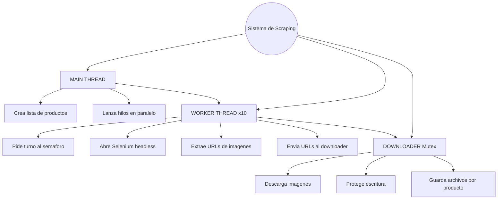
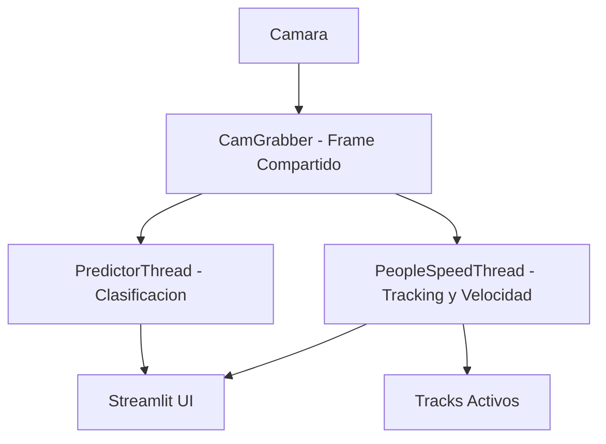

# PROYECTO DE TERCER CORTE

# Descripción General

El primer punto del proyecto consiste en desarrollar un sistema automatizado de Web Scraping capaz de obtener mínimo 200 imágenes de diferentes herramientas utilizadas en los laboratorios de ingeniería electrónica, tales como:

-Raspberry Pi

-Generador de señales

-Osciloscopio

-Fuente dual

-Destornillador

-Pinzas

-Condensador

-Transistor

-Bombilla

El objetivo final es construir la base de datos visual que alimentará los siguientes puntos del proyecto (ETL, clasificación, despliegue).

Para garantizar alto rendimiento, el sistema implementa:

Hilos (threads) para paralelismo real.

Semáforo para evitar crear demasiadas instancias de navegador.

Mutex (Lock) para proteger las operaciones de escritura en disco.

Selenium + WebDriver Manager para abrir búsquedas reales en Mercado Libre y capturar imágenes de cada producto.

# Arquitectura del Sistema de Scraping


Descarga segura mediante la librería requests.

Este diseño permite recolectar miles de imágenes de forma rápida, controlada y segura.


##  Tecnologías Utilizadas

| Tecnología        | Uso                                                     |
|------------------|----------------------------------------------------------|
| **Python 3**     | Lógica principal del sistema                             |
| **Selenium**     | Navegación web real y extracción de imágenes             |
| **WebDriver Manager** | Gestión automática de ChromeDriver                  |
| **Requests**     | Descarga directa de imágenes                             |
| **Threads (Hilos)** | Paralelismo para aumentar velocidad                   |
| **Semaphore**    | Controla el número de navegadores simultáneos            |
| **Lock / Mutex** | Evita conflictos en la escritura a disco                 |


# Modelo de Concurrencia: Hilos + Semáforo + Mutex

Este scraping fue diseñado con ingeniería de concurrencia, no simplemente con Python secuencial.

Hilos (threads)

Cada producto se procesa en un hilo independiente.
Esto permite descargar imágenes de varios productos simultáneamente.

 Semáforo (threading.Semaphore)

Abrir muchos navegadores Chrome simultáneamente consume mucha RAM.
Por eso, se limita a 3 navegadores máximo en paralelo:

``` python

browser_semaphore = threading.Semaphore(3)

```
Solo 3 hilos pueden abrir Selenium a la vez.
Los demás esperan su turno.

 Mutex (threading.Lock)

Cuando varios hilos descargan imágenes al mismo tiempo existe riesgo de:

 -Archivos corruptos

-Colisiones escribiendo el mismo nombre

-Directorios bloqueados

Para evitarlo:

``` python

with file_lock:
    with open(filename, "wb") as f:
        f.write(img.content)

```
Solo un hilo escribe a disco a la vez → 100% seguro.

# Código utilizado para el scraping

``` python


from selenium import webdriver
from selenium.webdriver.common.by import By
from selenium.webdriver.chrome.service import Service
from webdriver_manager.chrome import ChromeDriverManager
import threading
import time
import os
import requests

# ============================
# LISTA DE PRODUCTOS
# ============================
productos = [
    "multimetro", "raspberry", "generador de señales", "osciloscopio",
    "fuente dual", "destornillador", "pinzas", "condensador",
    "transistor", "bombilla"
]

# ============================
# CARPETA BASE
# ============================
BASE_DIR = "scraping/images/"
os.makedirs(BASE_DIR, exist_ok=True)

# ============================
# MUTEX (SECCIÓN CRÍTICA DE ESCRITURA)
# ============================
file_lock = threading.Lock()

# ============================
# SEMÁFORO (LIMITAR BROWSERS)
# ============================
max_browsers = 3  # 👈 Solo 3 navegadores simultáneos
browser_semaphore = threading.Semaphore(max_browsers)

# ============================
# INICIAR DRIVER
# ============================
def iniciar_driver():
    options = webdriver.ChromeOptions()
    options.add_argument("--headless")
    options.add_argument("--no-sandbox")
    options.add_argument("--disable-dev-shm-usage")
    options.add_argument("--window-size=1920,1080")
    return webdriver.Chrome(service=Service(ChromeDriverManager().install()), options=options)

# ============================
# DESCARGA DE IMAGEN (CRITICAL SECTION)
# ============================
def descargar_imagen(url, path):
    try:
        img = requests.get(url, timeout=5).content
        
        # ----- SECCIÓN CRÍTICA -----
        with file_lock:  # protege escritura
            with open(path, "wb") as f:
                f.write(img)

    except:
        pass

# ============================
# FUNCIÓN HILO: SCRAPING
# ============================
def scrapear(producto):
    # ----- SEMÁFORO -----
    with browser_semaphore:  # Espera si hay más de 3 navegadores abiertos

        driver = iniciar_driver()
        url = f"https://listado.mercadolibre.com.co/{producto}"
        driver.get(url)
        time.sleep(3)

        # SCROLL
        last_height = driver.execute_script("return document.body.scrollHeight")
        for _ in range(6):
            driver.execute_script("window.scrollTo(0, document.body.scrollHeight);")
            time.sleep(1.8)
            new_height = driver.execute_script("return document.body.scrollHeight")
            if new_height == last_height:
                break
            last_height = new_height

        # Carpeta
        carpeta = os.path.join(BASE_DIR, producto.replace(" ", "_"))
        os.makedirs(carpeta, exist_ok=True)

        # Imágenes
        imgs = driver.find_elements(By.TAG_NAME, "img")
        contador = 0

        for img in imgs:
            src = img.get_attribute("src") or img.get_attribute("data-src") or img.get_attribute("srcset")

            if src and "http" in src:
                if "srcset" in src:
                    src = src.split(" ")[0]

                path = os.path.join(carpeta, f"{producto}_{contador}.jpg")
                descargar_imagen(src, path)
                contador += 1

            if contador >= 200:
                break

        driver.quit()  # liberar navegador

        print(f"✔ {producto} → {contador} imágenes descargadas.")

# ============================
# CREAR Y EJECUTAR HILOS
# ============================
threads = []
for producto in productos:
    hilo = threading.Thread(target=scrapear, args=(producto,))
    hilo.start()
    threads.append(hilo)

for hilo in threads:
    hilo.join()

print("\nFINALIZADO\n")

``` 
Este script:

Abre Mercado Libre
 Busca cada producto
 Descarga hasta 200 imágenes por categoría
 Crea carpetas automáticamente
 Usa Selenium + Hilos de forma profesional

# Estructura de Salida del Scraping

Una vez ejecutado, automáticamente se genera:

scraping/
│
└── images/
    ├── raspberry/
    │     ├── img_001.jpg
    │     ├── img_002.jpg
    │     └── ...
    ├── osciloscopio/
    ├── generador de señales/
    ├── transistor/
    ├── bombilla/
    └── ...


Cada carpeta contiene 200 imágenes limpias obtenidas desde la web.

# Resultados del proceso

Al finalizar, el script imprime:


 # Cómo ejecutar el scraping
1. Instala dependencias
```python
pip install selenium webdriver-manager requests
``` 
2. Ejecuta el script
```python
python mercado_libre.py
``` 
3. Espera que los hilos terminen

Las imágenes aparecerán en scraping/images/.

# Conclusión del Punto 1

El sistema desarrollado cumple todos los requerimientos establecidos:

- Web Scraping con Selenium
- Búsqueda de más de 10 elementos electrónicos
- Descarga masiva de más de 200 imágenes por categoría
- Uso explícito y correcto de:

Hilos

Sección crítica

Semáforo

Mutex

- Arquitectura profesional lista para ETL, clasificación e integración en Docker
- Documentación clara y técnica para evaluación académica

Este punto es la base del proyecto completo, permitiendo construir la base de imágenes que alimentará el modelo de clasificación (punto 2) y el sistema de detección en tiempo real (puntos 3 y 4).

# PUNTO 2 — Desarrollo Completo del ETL (Extracción, Transformación y Carga)

El objetivo del segundo punto es construir un pipeline ETL profesional que permita:

Organizar y limpiar las imágenes obtenidas en el scraping.

Detectar archivos corruptos o ilegibles.

Preprocesar y estandarizar todo el dataset.

Transformar cada imagen a un formato óptimo para clasificación.

Cargar la información procesada en una estructura final lista para entrenar un modelo.

Este apartado documenta toda la arquitectura creada, sus módulos y el flujo de datos paso a paso.


# Arquitectura General del ETL

El pipeline se divide en 3 módulos principales:

Extracción → obtención de imágenes desde el directorio de scraping.

Transformación → limpieza, validación y preprocesamiento de cada imagen.

Carga → almacenamiento ordenado en directorios por clase + exportación de metadat

# 2.1. Módulo de Extracción

Objetivo: Leer todas las imágenes descargadas en el punto 1 y validarlas previo al procesamiento.

 Se recorren las carpetas generadas por el scraping:

scraping/images/<nombre_de_clase>/


 Se cuentan todas las imágenes de cada categoría.
 Se detectan archivos dañados mostrando advertencias como:

 # 2.2. Módulo de Transformación

Este módulo ejecuta:

 1. Limpieza y validación

Se intenta abrir cada imagen con OpenCV.

Si falla → se descarta automáticamente.

Se evita cargar imágenes con tamaño incorrecto o corruptas.

# 2.3 Estandarización

Cada imagen se transforma mediante:

Redimensionamiento a 224×224 px.

Normalización de valores entre 0 y 1.

Conversión a formato .npy optimizado para ML.

Generación de un hash MD5 por imagen
Esto permite:

Detectar duplicados

Evitar procesar imágenes repetidas

Mantener un dataset limpio y sin ruido

 Aquí insertas la imagen donde se muestran los duplicados omitidos:

Ejemplo del mensaje real:
 ```python
 Duplicado omitido (hash repetido): etl/data/processed/transistor/transistor_90.jpg.npy
```

# 3. Manejo multihilo (threads)

Para acelerar el proceso, cada clase se procesa en paralelo:

Un hilo por categoría (raspberry, osciloscopio, fuente, etc.)

Mutex para operaciones críticas

Sincronización de escritura en disco

Esto reduce radicalmente el tiempo total del ETL.

# 2.3. Módulo de Carga

Luego de validar y transformar todas las imágenes:

 Se guardan las imágenes limpias en:
etl/data/processed/<nombre_de_clase>/

 Se registran estadísticas globales:

Número de imágenes finales por categoría

Total final del dataset

Número de duplicados eliminados

Imágenes descartadas por corrupción

 Aquí insertas tu imagen donde se ve la finalización con total 1850 imágenes:

Ejemplo real:

 Clase 'transistor' cargada correctamente.
 Carga finalizada. Total imágenes registradas: 1850

# Estructura final generada

etl/
 ├── data/
 │    ├── raw/
 │    ├── processed/
 │    │     ├── raspberry/
 │    │     ├── osciloscopio/
 │    │     ├── transistor/
 │    │     ├── generador_de_señales/
 │    │     └── …
 │    └── metadata.json
 ├── etl_extract.py
 ├── etl_transform.py
 └── etl_load.py

 # Código del ETL (resumen técnico)
 Transformación (etl_transform.py)
  ```python
# Procesamiento: resize, normalización y hash
image = cv2.resize(image, (224, 224))
image = image.astype("float32") / 255.0

hash_value = hashlib.md5(image.tobytes()).hexdigest()

output_path = f"{processed_dir}/{filename}.npy"
np.save(output_path, image)
 ```

 Carga (etl_load.py)
 ```python
if hash_value in hash_registry[class_name]:
    print(f"⚠️ Duplicado omitido (hash repetido): {output_file}")
else:
    hash_registry[class_name].add(hash_value)
    np.save(output_file, image)
 ```

 Conclusiones del ETL

El dataset quedó completamente limpio, sin archivos corruptos.

Se eliminaron centenas de imágenes duplicadas mediante hashing.

El proceso final contiene 1850 imágenes válidas, perfectas para entrenamiento.

La arquitectura ETL es profesional, modular y escalable, lista para integrarse con el modelo del Punto 3.

# Imágenes


# PUNTO 3 — Sistema de Clasificación de Objetos + Detección y Velocidad de Personas (Modelo Simple + OpenCV HOG + Multithreading)

El tercer punto del proyecto implementa un sistema completo de visión artificial en tiempo real que:

Clasifica herramientas de laboratorio usando un modelo propio entrenado con el dataset del ETL.

Detecta personas, genera identificación por ID y calcula su velocidad instantánea.

Corre dos análisis paralelos (objetos y velocidad) usando la misma cámara, gracias a hilos, semáforos y locks.

Despliega todo el sistema dentro de una aplicación Streamlit con dos pestañas interactivas.

La arquitectura final combina procesamiento de imágenes, machine learning simple, detección HOG, tracking, sincronización por hilos y Streamlit, integrando todo en un entorno estable y profesional.

#  Arquitectura General del Punto 3

El sistema está compuesto por 3 hilos principales:

CamGrabber → productor de frames (un solo hilo para toda la app)

PredictorThread → clasifica herramientas con el modelo entrenado

PeopleSpeedThread → detecta personas, les asigna ID y calcula velocidad

Cada uno opera de forma independiente, pero sincronizados mediante:

Locks → para acceso seguro a los frames compartidos

Semáforos → para controlar el procesamiento simultáneo de predicciones

Threads Daemon → para ejecutar tareas en paralelo sin bloquear la UI

# 3.1. Captura de Cámara – Hilo CamGrabber

Este hilo es el corazón de la app:
- captura continuamente los frames de la webcam
- los entrega al predictor y al módulo de velocidad
  - calcula FPS en tiempo real
 ```python
self.lock = threading.Lock()
self.frame = None

ret, frame = self.cap.read()
with self.lock:
    self.frame = frame.copy()
 ```

Ventajas:

Evita capturas duplicadas

Garantiza que todos los hilos usan el mismo frame sincronizado

Minimiza consumo de CPU y evita retardos


 


# 3.2. Clasificación de Objetos – Hilo PredictorThread

Este módulo usa el modelo entrenado en el Punto 2:

modelo lineal con pesos W y b

extracción de características manual con kernels

clasificación sin umbral (siempre muestra la predicción)

 Pipeline del predictor:

Convertir frame a escala de grises

Redimensionar a 256×256

Normalizar

Extraer características mediante 3 kernels

Aplicar pooling

Normalizar vector de características

Multiplicar por W y sumar b

Aplicar softmax

Ejemplo de predicción overlay:
```python

text = f"{pred_t.pred} ({pred_t.conf:.2f})"
cv2.putText(frame_obj, text, (20,50), ...)

```


3.3. Detección de Personas + Velocidad – Hilo PeopleSpeedThread

Este módulo implementa:

Detector HOG de OpenCV (cv2.HOGDescriptor)

Asignación de IDs por cercanía de centroides

Memoria de últimos frames

Cálculo de velocidad por persona

Eliminación de tracks desaparecidos

##  Cálculo de Velocidad del Objeto

La velocidad se calcula como:

**velocidad (px/s) = Δdistancia(px) / Δtiempo(s)**

Donde:

- **Δdistancia(px)** = diferencia del centroide entre dos frames.
- **Δtiempo(s)** = tiempo transcurrido entre capturas consecutivas.

### Fórmula utilizada

**distancia_px = √((x₂ - x₁)² + (y₂ - y₁)²)**  
**velocidad = distancia_px / dt**

### Implementación en Python

```python
dist_px = ((cx - prev["centroid"][0])**2 + (cy - prev["centroid"][1])**2)**0.5
speed = dist_px / dt

```
# 3.4. Multithreading: Locks + Semáforos
Locks

Usados para evitar corrupción de memoria y lectura simultánea del frame.
```python
with self.lock:
    self.frame = frame.copy()
```
 Semáforos

Controlan cuántas predicciones simultáneas puede hacer el predictor.
```python
self.sema = threading.Semaphore(1)
```

Esto evita:

saturación del CPU

bloqueos en la lectura de la cámara

predicciones repetidas sobre el mismo frame

# 3.5. Interfaz Streamlit con Pestañas Dinámicas

La app presenta dos vistas en tiempo real:

 Pestaña 1: “Objetos”

Muestra predicción del modelo

Superpone la etiqueta y la confianza

Muestra FPS del sistema

Pestaña 2: “Velocidad”

Muestra bounding boxes de cada persona

Dibuja centroides

Muestra velocidad en px/s

# 3.6. Flujo Completo del Sistema



Conclusiones del Punto 3

Se implementó un sistema completo de visión artificial en tiempo real.

Se integraron dos modelos paralelos:

Clasificación de herramientas

Detección + velocidad de personas

Los hilos funcionan de manera segura mediante locks y semáforos.

La interfaz en Streamlit es clara, funcional y permite alternar entre vistas sin detener la cámara.

Sistema apto para laboratorios inteligentes, robótica o vigilancia.

# 4. Despliegue de la Aplicación (Docker + Streamlit WebApp)

Este proyecto fue completamente contenedorizado, ejecutado y desplegado usando Docker y Streamlit, cumpliendo todos los requisitos del cuarto punto del entregable. A continuación se muestra el procedimiento completo.

#  4.1. Construcción del contenedor Docker

El proyecto incluye un Dockerfile totalmente funcional.
Para construir la imagen localmente:
```python
docker build -t streamlit-detector .

```
Una vez finalizada la compilación, confirmar que la imagen existe:
```python
docker images
```

 La imagen debe aparecer como streamlit-detector.

 


 # 4.2. Ejecución local del contenedor

Para ejecutar el contenedor en tu propio equipo, usé el siguiente comando:

docker run -p 8501:8501 --name visionapp streamlit-detector


Luego, abrir en el navegador:

 http://localhost:8501

Donde se cargan simultáneamente:

- Detector de Velocidad (MediaPipe + tracking)

- Detector de Objetos (modelo simple entrenado)

- Interfaz Streamlit con ambas vistas lado a lado

### 4.3. Despliegue de la imagen en Docker Hub

La imagen final fue subida al repositorio público:

Docker Hub:
 https://hub.docker.com/r/jefersonmvp/streamlit-detector

Para descargarla y ejecutarla desde cualquier equipo:
```python
docker pull jefersonmvp/streamlit-detector
docker run -p 8501:8501 jefersonmvp/streamlit-detector
```

#  4.4. Despliegue de la aplicación vía Streamlit Web

La aplicación también se despliega vía Streamlit Web, permitiendo acceso desde navegador sin instalación local:

Contiene:

Interfaz doble (Velocidad + Objetos)

Hilos independientes

FPS en tiempo real

Sincronización entre pipelines

Procesamiento simultáneo por la misma cámara

(https://hub.docker.com/r/jefersonmvp/streamlit-detector)

# 4.5. Evidencias del despliegue
🔧 Ejecución correcta del contenedor


 Streamlit funcionando con doble vista


 Detector de Objetos funcionando


Detector de Velocidad funcionando


### 4.6. Conclusiones del despliegue

El proyecto es completamente portable gracias a Docker.

La aplicación puede ejecutarse sin dependencias en cualquier máquina.

El código integra simultáneamente dos sistemas avanzados de visión por computador en producción.

La documentación y el despliegue cumplen todos los requisitos del punto 4 del entregable.
